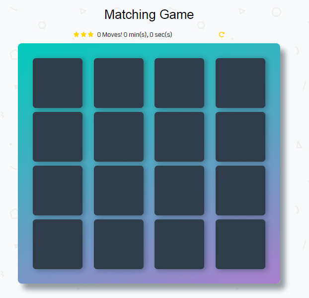

# Memory Game Project

## Table of Contents
* What Is Memory Game
* Instructions
* How to play the game

## What Is Memory Game
Memory game require a player to match similar carda. 
For example, there are 12 cards composed of 6 pairs in random order. 
A player selects two cards with the goal of having matching pair by using their memory. 

### GitHub Project Demo
* Project Demo: <https://latifau.github.io/fend-project-memory-game-master/>
### GitHub Project Repository
* Download ZIP file from repository: <https://github.com/LatifaU/fend-project-memory-game-master>
* Unzip file.
* Open index.html into browser.

## Instructions
* Select two cards
* Keep viewing cards and to remember each card and where it was.
* If the two cards match, they will be turned up.
* If the two cards don't match, they will be turned down.
* The game is over when all the cards have been matched.
* Remember, try to win with less moves and in faster time to gain more stars.

## Screenshots

## Game Resources
### Shuffle function 
* <http://stackoverflow.com/a/2450976>
### setTimeout & setInterval 
* <https://developer.mozilla.org/en-US/docs/Archive/Add-ons/Code_snippets/Timers>
* <https://www.w3schools.com/jsref/met_win_settimeout.asp>
* <https://www.w3schools.com/jsref/met_win_setinterval.asp>

## Udacity Resources:
* Project Description 
<https://classroom.udacity.com/nanodegrees/nd001-connect/parts/3cf2dfce-1fd2-4973-b185-7b71fd244754/modules/677caa06-55d6-444e-a853-08627c5516a7/lessons/4227cbf4-f6ce-4798-a7e5-b1ce3b9e7c33/project>
